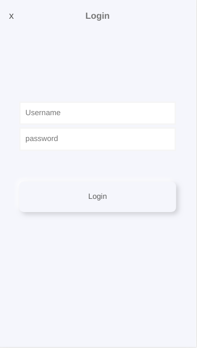
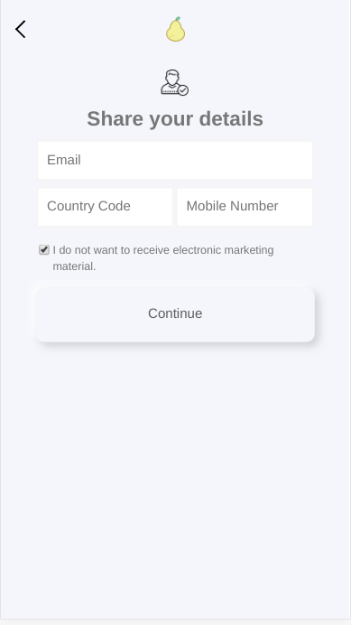
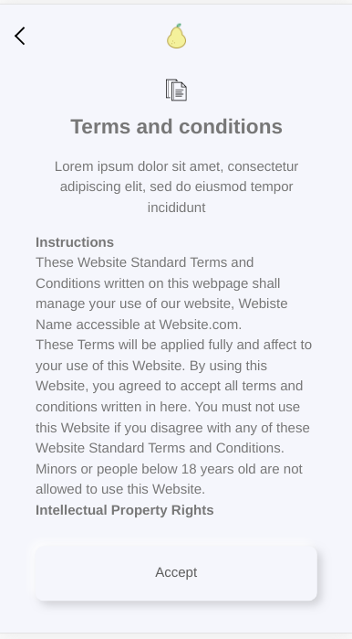
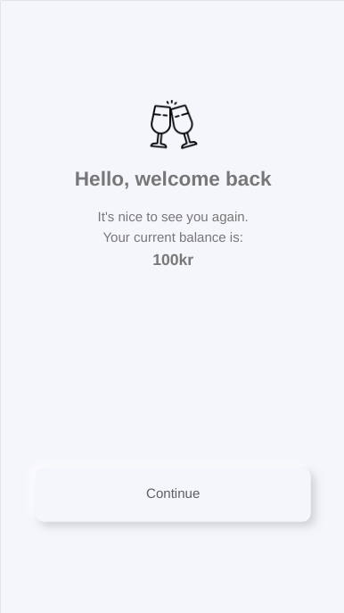
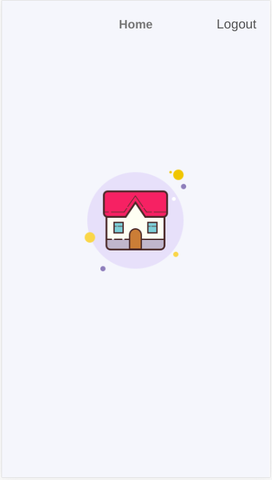

<h1 align="center">Welcome to Frontend Challenge for ComeOn - front 👋</h1>
<p>
  
  <a href="https://github.com/guadalazzo/comeOn#readme" target="_blank">
    
  </a>
  <a href="https://github.com/guadalazzo/comeOn/graphs/commit-activity" target="_blank">
    
  </a>
  <a href="https://github.com/guadalazzo/comeOn/blob/master/LICENSE" target="_blank">
    
  </a>
  <a href="https://twitter.com/luppelazzo" target="_blank">
    
  </a>
</p>

A simple Registration and login flow created in react without any precreated setups connected to a node server, it use formik and Yup for validations, Jest for unit testing, Sass as a css preprocessor, and eslint as code formatter.
There are two common cases:
A => NEW USER
B => REGISTRED USER

A - When a new user acces to the route */* checks if it's logged in, if not  redirects to login page

B - When a registered user acces to the route */* checks in wich state drop out and send him to that point.
### 1. Registration/Login Screen "/login"

  A - New user register, if passes the validation and click login, the user is sended to the backend for storage, the flow continues to user info screen
  
  B - The user access, if the backend answer with succes to the username and password sendend by the user, it take it to the page where it drop out the last time.
 
   
   <br/>
   <br/>
   
### 2. User Information Screen
  
  A - Complete the required data, if the validations are ok, if it click continue it will be send to backend and continues to terms and condition page.
  
  B - If the user want, can change the current data, if not, when click continue it goes to the welcome step.
  
   
   <br/>
   <br/>

### 3. Terms and Conditions Screen

A & B - The users Read and click to continue, when it happens sends this info to the backend updating the user

   
   <br/>
   <br/>

### 4. Welcome Screen

A & B - click to continue, this will send them home. 

   
   <br/>
   <br/>
   
### 4. Home

  A & B - Both can logout, it will take them to login again.

  
   <br/>
   <br/>
   
   
## Install

```sh
npm install
```

## Usage

```sh
npm run start
```

## Run tests

```sh
npm run test
```
## Run Eslint

```sh
npm run eslint-fix
```

## Author

👤 **Guadalupe Jazmin Lazzo**

* Website: http://guadalazzo.github.io
* Twitter: [@luppelazzo](https://twitter.com/luppelazzo)
* Github: [@guadalazzo](https://github.com/guadalazzo)
* LinkedIn: [@https:\/\/www.linkedin.com\/in\/guadalupe-jazmin-lazzo\/](https://linkedin.com/in/https:\/\/www.linkedin.com\/in\/guadalupe-jazmin-lazzo\/)

## 🤝 Contributing

Contributions, issues and feature requests are welcome!<br />Feel free to check [issues page](https://github.com/guadalazzo/comeOn/issues). 

## Show your support

Give a ⭐️ if this project helped you!

## 📝 License

Copyright © 2020 [Guadalupe Jazmin Lazzo](https://github.com/guadalazzo).<br />
This project is [ISC](https://github.com/guadalazzo/comeOn/blob/master/LICENSE) licensed.

***
_This README was generated with ❤️ by [readme-md-generator](https://github.com/kefranabg/readme-md-generator)_
